# 📝 OMR Answer Sheet Scanner


A professional **Optical Mark Recognition (OMR)** system built with Python that automatically grades multiple-choice answer sheets. This system uses advanced computer vision techniques to detect, extract, and evaluate marked answers from scanned images.

## ✨ Features

- **🎯 Automatic Answer Sheet Detection**: Custom contour detection algorithm to identify answer bubbles
- **📊 Batch Processing**: Process multiple answer sheets at once
- **📈 Comprehensive Results**: Detailed statistics including grades, pass rates, and performance insights
- **💾 Excel Export**: Export results with student IDs, scores, grades, and summary statistics
- **🖥️ Modern GUI**: Professional dark-themed interface with intuitive controls
- **⚙️ Flexible Configuration**: Customize number of questions, choices, answer keys, and grading parameters
- **📸 Visual Feedback**: Step-by-step visualization of image processing stages
- **🔄 Real-time Preview**: Thumbnail preview of uploaded answer sheets

## 🚀 Demo

### GUI Screenshots

<div align="center">

<table>
<tr>
<td align="center">
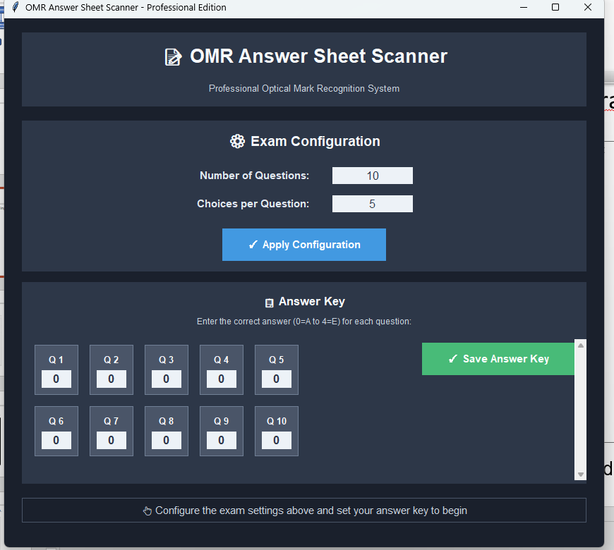<br/>
<b>Main Configuration Window</b><br/>
<sub>Configure exam settings and set answer keys</sub>
</td>
<td align="center">
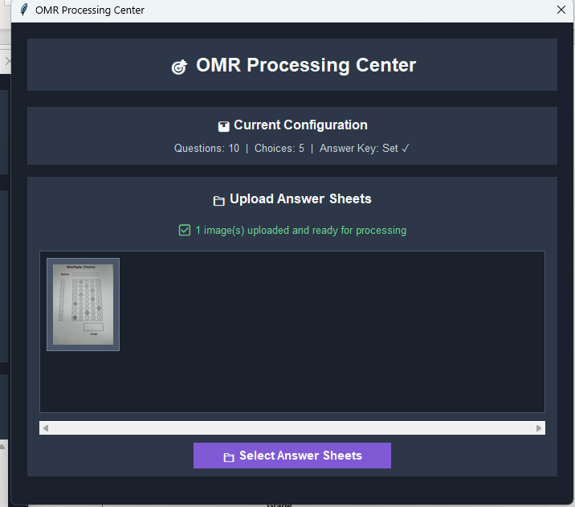<br/>
<b>Processing Center</b><br/>
<sub>Upload and process multiple answer sheets</sub>
</td>
</tr>
</table>

</div>

### Step-by-Step Processing Pipeline

The system processes answer sheets through multiple stages with visual feedback:

<div align="center">

<table>
<tr>
<td align="center">
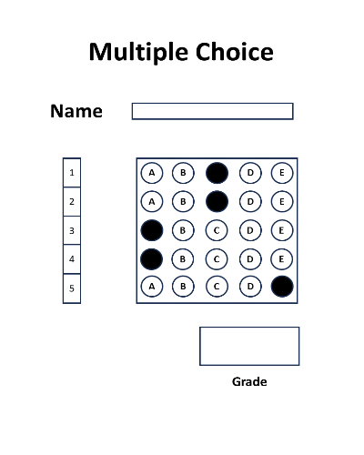<br/>
<b>1. Input Image (Resized)</b><br/>
<sub>Original answer sheet resized to standard dimensions (400x500)</sub>
</td>
<td align="center">
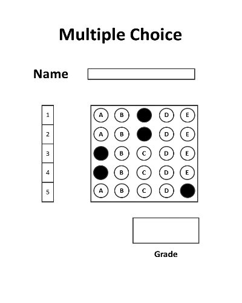<br/>
<b>2. Grayscale Conversion</b><br/>
<sub>Converted to grayscale for processing</sub>
</td>
</tr>

<tr>
<td align="center">
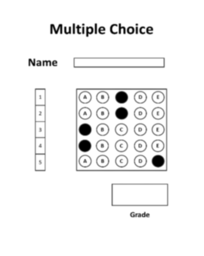<br/>
<b>3. Gaussian Blur</b><br/>
<sub>Applied Gaussian blur to reduce noise</sub>
</td>
<td align="center">
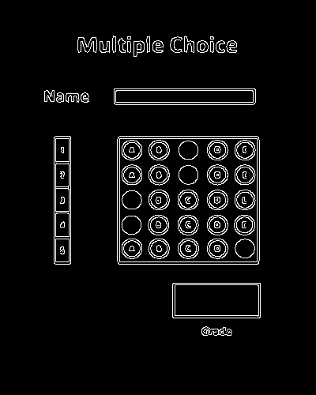<br/>
<b>4. Edge Detection (Canny)</b><br/>
<sub>Detected edges using Canny algorithm</sub>
</td>
</tr>

<tr>
<td align="center">
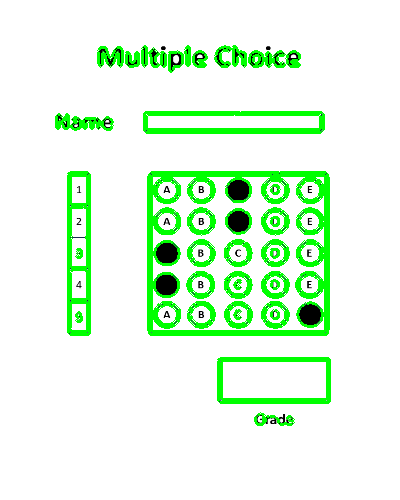<br/>
<b>5. Contour Detection</b><br/>
<sub>Custom algorithm detects all regions and boundaries</sub>
</td>
<td align="center">
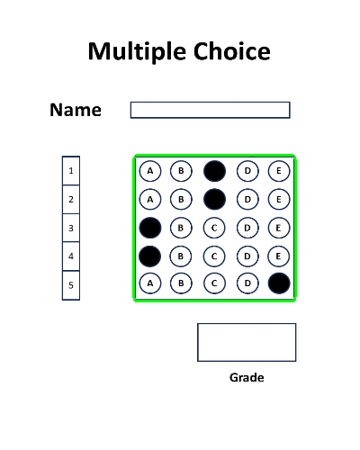<br/>
<b>6. Answer Section Identification</b><br/>
<sub>Largest contour identified as the answer section</sub>
</td>
</tr>

<tr>
<td align="center">
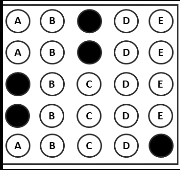<br/>
<b>7. Region of Interest (ROI) Extraction</b><br/>
<sub>Extracted and aligned answer grid</sub>
</td>
<td align="center">
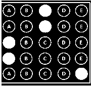<br/>
<b>8. Binary Thresholding</b><br/>
<sub>Binary threshold applied to identify filled bubbles</sub>
</td>
</tr>

<tr>
<td align="center">
<br/>
<b>9. Answer Detection & Grading</b><br/>
<sub>Green = Correct, Red = Incorrect (with correct answer shown)</sub>
</td>
<td align="center">
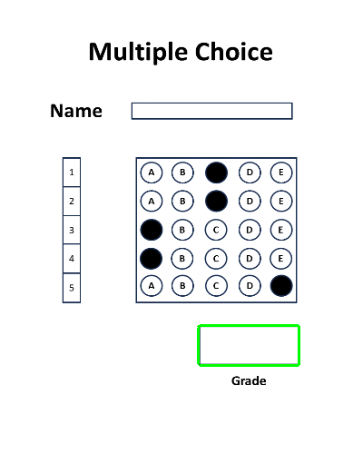<br/>
<b>10. Grade Section</b><br/>
<sub>Grade section identified for result annotation</sub>
</td>
</tr>

<tr>
<td align="center" colspan="2">
<br/>
<b>11. Final Result</b><br/>
<sub>Score overlaid on the answer sheet</sub>
</td>
</tr>

</table>

</div>

## 📋 Requirements

### Python Version
- Python 3.8 or higher

### Dependencies

```
opencv-python>=4.5.0
numpy>=1.19.0
openpyxl>=3.0.0
Pillow>=8.0.0
```

## 🔧 Installation

1. **Clone the repository**
```bash
git clone https://github.com/tamim2007009/Image-Processing-Project-OMR-System.git
cd Image-Processing-Project-OMR-System
```

2. **Create a virtual environment (recommended)**
```bash
python -m venv venv

# On Windows
venv\Scripts\activate

# On macOS/Linux
source venv/bin/activate
```

3. **Install required packages**
```bash
pip install -r requirements.txt
```

If `requirements.txt` is not available, install manually:
```bash
pip install opencv-python numpy openpyxl Pillow
```

## 🎮 Usage

### Running the Application

```bash
python main.py
```

### Step-by-Step Guide

1. **Configure Exam Settings**
   - Set the number of questions (1-100)
   - Set the number of choices per question (2-10)
   - Click "Apply Configuration"

2. **Set Answer Key**
   - Enter the correct answer for each question
   - Use numbers: 0=A, 1=B, 2=C, 3=D, etc.
   - Click "Save Answer Key"

3. **Upload Answer Sheets**
   - Click "Select Answer Sheets" in the popup window
   - Choose one or multiple scanned images
   - Supported formats: PNG, JPG, JPEG, GIF, BMP

4. **Process and Review**
   - Click "Process All Images"
   - Review intermediate processing steps (optional)
   - View results in console and save to Excel

5. **Export Results**
   - Choose save location for Excel file
   - File includes individual scores and summary statistics

## ⚙️ Configuration

All settings can be customized in `config.py`:

### Image Processing Parameters

```python
IMAGE_WIDTH = 400                    # Resized image width
IMAGE_HEIGHT = 500                   # Resized image height
BLUR_KERNEL_SIZE = (5, 5)           # Gaussian blur kernel
CANNY_THRESHOLD1 = 50               # Canny edge detection lower threshold
CANNY_THRESHOLD2 = 150              # Canny edge detection upper threshold
THRESHOLD_VALUE = 170               # Binary threshold for bubble detection
```

### Exam Configuration

```python
NUM_QUESTIONS = 10                   # Total number of questions
NUM_CHOICES = 5                      # Choices per question (A, B, C, D, E)
ANSWER_KEY = [0, 0, 0, ...]         # Correct answers (0-indexed)
```

### Grading System

```python
PASS_MARK = 40.0                     # Minimum passing percentage

GRADE_BOUNDARIES = {
    'A': 80,    # 80-100%
    'B': 60,    # 60-79%
    'C': 40,    # 40-59%
    'F': 0      # 0-39%
}
```

### Advanced Options

```python
# Answer section offset adjustment
ANSWER_CORNER_OFFSET = {
    'top_left_x': 0,
    'top_left_y': 0,
    'bottom_right_x': 0,
    'bottom_right_y': 0
}

# Border padding for answer extraction
BORDER_PADDING = {
    'top': 0,
    'bottom': 0,
    'left': 0,
    'right': 0
}

# Edge exclusion for corner marker filtering
EDGE_EXCLUSION_MARGIN = 0           # 0 to disable, 0.1-0.3 for filtering
```

## 📁 Project Structure

```
OMR/
│
├── main.py              # Main application with GUI
├── config.py            # Configuration parameters
├── helper.py            # Image processing utilities
├── README.md            # This file
├── requirements.txt     # Python dependencies (create this)
│
└── snapshots/           # Optional: Processed image outputs
```

## 🔬 How It Works

### Processing Pipeline Overview

```
Input Image → Preprocessing → Contour Detection → ROI Extraction → 
Answer Detection → Grading → Results Export
```

### 1. Custom Contour Detection Algorithm

The system uses a **custom connected-component contour tracing algorithm** instead of OpenCV's built-in `findContours`:

- **BFS (Breadth-First Search)** for region growing
- **DFS (Depth-First Search)** for edge tracing
- More accurate detection of answer sheet regions

See the [Contour Detection](#5-contour-detection) output above for visual results.

```python
# From helper.py
def get_edge_points(image):
    # Custom implementation that finds contours using BFS/DFS
    # Returns list of contour points for each detected region
```

### 2. Corner Detection and ROI Extraction

After detecting contours, the system identifies the largest region (answer section) and extracts its corners for precise alignment.

```python
def find_corners(contour):
    # Finds the 4 corners of each detected region
    # Returns: [(top_left), (top_right), (bottom_left), (bottom_right)]
```

See [Answer Section Identification](#6-answer-section-identification) and [ROI Extraction](#7-region-of-interest-roi-extraction) above.

### 3. Answer Bubble Analysis

- Splits answer region into grid (questions × choices)
- Counts non-zero pixels in each bubble
- Maximum pixel count indicates selected answer
- Compares with answer key for grading

The [Binary Thresholding](#8-binary-thresholding) step shows how bubbles are converted to binary for pixel counting.

### 4. Grading and Statistics

- Individual scores and grades
- Class statistics (average, highest, lowest)
- Grade distribution (A, B, C, F)
- Pass/fail analysis

See the [Answer Detection & Grading](#9-answer-detection--grading) output showing correct (green) and incorrect (red) answers.

## 📊 Output Format

### Console Output

```
📊 RESULT SUMMARY 📊
======================================================================

📈 OVERALL STATISTICS:
   Total Students     : 25
   Average Score      : 76.80%
   Highest Score      : 100.00%
   Lowest Score       : 40.00%
   Pass Rate          : 92.00% (23/25)

📊 GRADE DISTRIBUTION:
   Grade A (80-100%)  : 12 students (48.0%)
   Grade B (60-79%)   : 8 students (32.0%)
   Grade C (40-59%)   : 3 students (12.0%)
   Grade F (0-39%)    : 2 students (8.0%)
```

### Excel Export

The Excel file includes:
- Individual student results (ID, Score, Grade, Status)
- Summary statistics
- Grade distribution with percentages
- Formatted headers and column widths

## 🎯 Answer Sheet Requirements

For optimal results, answer sheets should have:

1. **Clear bubble/box marks** for answers
2. **Distinct boundaries** around answer section
3. **High contrast** between marked and unmarked areas
4. **Minimal skew** (< 15 degrees)
5. **Good lighting** and scan quality (300+ DPI recommended)
6. **Three distinct sections** detectable as contours:
   - Answer section (largest area)
   - Grade section
   - Student ID/Name section

## 🛠️ Troubleshooting

### Issue: Contours not detected properly
**Solution**: Adjust Canny thresholds in `config.py`
```python
CANNY_THRESHOLD1 = 30    # Try lower values
CANNY_THRESHOLD2 = 100
```

### Issue: Wrong answers detected
**Solution**: Adjust binary threshold
```python
THRESHOLD_VALUE = 180    # Increase for darker marks
```

### Issue: ROI extraction fails
**Solution**: Adjust corner offsets
```python
ANSWER_CORNER_OFFSET = {
    'top_left_x': 5,
    'top_left_y': 5,
    'bottom_right_x': -5,
    'bottom_right_y': -5
}
```

### Issue: Corner markers interfering
**Solution**: Enable edge exclusion
```python
EDGE_EXCLUSION_MARGIN = 0.15
```

## 🔍 Advanced Features

### Smart ROI Detection
Automatically filters out corner markers and edge noise to focus on actual answer bubbles.

### Configuration Validation
Built-in validation ensures all settings are within valid ranges before processing.

### Error Handling
Comprehensive error handling with fallback mechanisms for robust processing.

## 🤝 Contributing

Contributions are welcome! Please feel free to submit a Pull Request.

1. Fork the repository
2. Create your feature branch (`git checkout -b feature/AmazingFeature`)
3. Commit your changes (`git commit -m 'Add some AmazingFeature'`)
4. Push to the branch (`git push origin feature/AmazingFeature`)
5. Open a Pull Request

## 📝 License

This project is licensed under the MIT License - see the LICENSE file for details.

## 👤 Author

**Tamim**
- GitHub: [@tamim2007009](https://github.com/tamim2007009)

## 🙏 Acknowledgments

- OpenCV community for excellent computer vision tools
- Contributors and testers who helped improve the system

## 📧 Contact

For questions or support, please open an issue on the [GitHub repository](https://github.com/tamim2007009/Image-Processing-Project-OMR-System/issues).

---

**⭐ If you find this project helpful, please give it a star!**
